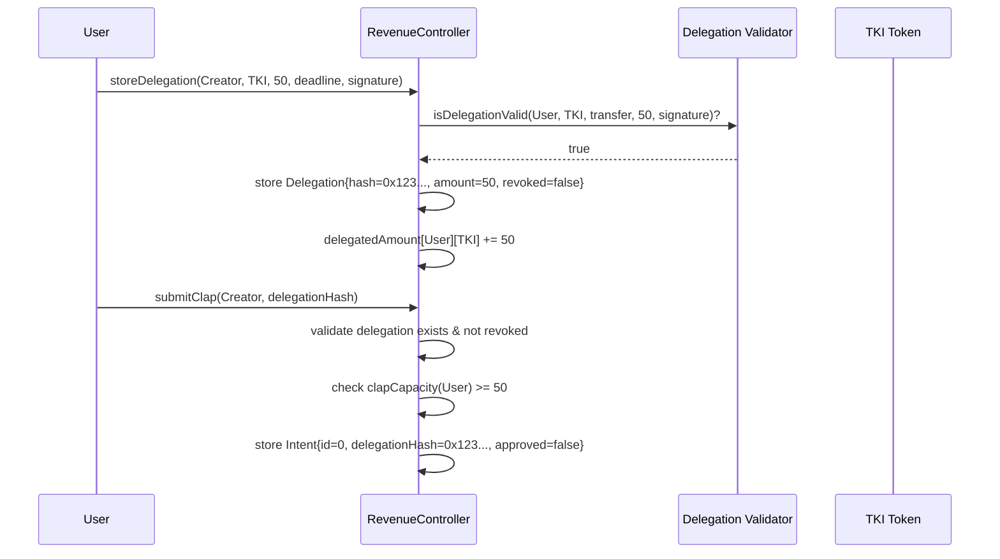

# TikTok TechJam Smart Contract Architecture

## 🏗️ Overview

The TikTok TechJam smart contract system implements a sophisticated revenue distribution mechanism that combines **interest-bearing stablecoins**, **social engagement tokens**, and **delegated transfers** to create a fair and efficient creator economy. The architecture enables users to earn interest on their deposits while supporting creators through "claps" and "gifts" with built-in fraud prevention and automated settlement.

## 🎯 Core Concept

The system operates on a **dual-token model** where:

- **TK (TikTok USD)** - A stablecoin representing real USD value
- **TKI (TikTok Interest)** - An interest-bearing token that accrues value over time and serves as a "clap" mechanism

Users can support creators by either:

1. **Clapping** - Spending accumulated TKI (interest earned)
2. **Gifting** - Spending TK directly (stablecoin)

## 🏛️ Contract Architecture

### **1. RevenueController (Core Orchestrator)**

The `RevenueController` is the central contract that manages all interactions between users, creators, and tokens. It implements a **Compound-like interest accrual system** with **intent-based settlement**.

#### **Key Features:**

- **Index-based Interest Accrual** - Global interest rate that compounds over time
- **Intent Queue System** - Batches user actions for efficient processing
- **Reservation Mechanism** - Prevents double-spending before settlement
- **Automated Settlement** - Periodic processing of approved intents
- **TKI to TK Conversion** - Converts creators' accumulated TKI to spendable TK

#### **Core Parameters:**

```solidity
uint256 public constant BPS = 10_000;                    // 100% = 10,000 bps
uint256 public secondsPerMonth = 30 days;                // Month definition for pro-rating
uint256 public accrualInterval = 1 days;                 // Minimum gap between index updates
uint256 public settlementPeriod = 7 days;                // Epoch length for settlements
uint256 public tkiPerTkRatio = 100;                      // 100 TKI : 1 TK conversion rate
uint256 public maxRebateMonthlyBps;                      // Safety cap (e.g., 1000 = 10%)
uint256 public rebateMonthlyBps;                         // Current rate (e.g., 200 = 2%)
```

### **2. TK Token (Stablecoin)**

The `TK` contract represents the stable USD token that users can deposit, withdraw, and gift to creators.

#### **Key Features:**

- **Standard ERC20** with OpenZeppelin v5 implementation
- **Role-based Access Control** for secure operations
- **Operator Transfer** - Allows the controller to move tokens during settlement
- **Minting/Burning** - Controlled by authorized roles only

#### **Access Control Roles:**

```solidity
bytes32 public constant MINTER_ROLE = keccak256("MINTER_ROLE");     // Mint TK on fiat on-ramp
bytes32 public constant BURNER_ROLE = keccak256("BURNER_ROLE");     // Burn TK on off-ramp
bytes32 public constant OPERATOR_ROLE = keccak256("OPERATOR_ROLE"); // Transfer during settlement
```

### **3. TKI Token (Interest & Clap Token)**

The `TKI` contract represents the interest-bearing token that accrues value over time and serves as the primary mechanism for user engagement.

#### **Key Features:**

- **Interest Accrual** - TKI is minted based on TK holdings and time
- **Actor Registry** - Distinguishes between regular users and creators
- **Clap Mechanism** - Users spend TKI to support creators
- **Conversion System** - Creators' TKI is converted to TK at settlement

#### **Actor Types:**

```solidity
enum ActorType {
    Unset,      // Default state
    User,       // Regular user who can earn TKI
    Creator     // Content creator who receives support
}
```

### **4. Delegation System (ERC-7710)**

The system implements a comprehensive **ERC-7710 delegation framework** that enables users to create, store, and manage delegations for secure, permissionless transfers without requiring individual transaction signatures.

#### **Delegation Structure:**

```solidity
struct Delegation {
    address delegator;      // User creating the delegation
    address delegatee;      // Creator receiving the delegation
    address token;          // TK or TKI token address
    bytes4 selector;        // ERC20.transfer selector
    uint256 amount;         // Amount to be delegated
    uint256 nonce;          // Delegation nonce for uniqueness
    uint256 deadline;       // Expiration timestamp
    bytes signature;        // ERC-7710 signature
    bool revoked;           // Revocation status
    uint64 createdAt;       // Creation timestamp
}
```

#### **Delegation Management Functions:**

```solidity
// Store a new delegation
function storeDelegation(
    address delegatee,
    address token,
    uint256 amount,
    uint256 deadline,
    bytes calldata signature
) external returns (bytes32 delegationHash);

// Revoke a delegation (user or admin)
function revokeDelegation(bytes32 delegationHash) external;

// Batch revoke delegations (admin only)
function revokeDelegations(bytes32[] calldata delegationHashes) external onlyOwner;
```

#### **Delegation Validator Interface:**

```solidity
interface IDelegationValidator {
    function isDelegationValid(
        address delegator,
        address token,
        bytes4 selector,
        uint256 amount,
        bytes calldata delegation
    ) external view returns (bool);

    function hashDelegation(bytes calldata delegation) external view returns (bytes32);

    function redeemDelegation(bytes calldata delegation) external returns (bool);
}
```

## 🔄 System Flow

### **Phase 1: User Onboarding & Interest Accrual**


### **Phase 2: Delegation Creation & Intent Submission**



### **Phase 3: Approval & Settlement**

```mermaid
sequenceDiagram
    participant Admin
    participant RC as RevenueController
    participant DV as Delegation Validator
    participant TKI as TKI Token
    participant TK as TK Token

    Admin->>RC: approveIntents([0], [true])
    Note over RC: Settlement period elapses
    RC->>RC: settleEpoch([0], [Creator])

    RC->>RC: accrueFor(Creator) [final TKI credit]
    RC->>DV: redeemDelegation(delegation.signature)
    DV-->>RC: true [delegation redeemed on-chain]
    RC->>TKI: operatorTransfer(User → Creator, 50 TKI)
    RC->>RC: delegatedAmount[User][TKI] -= 50
    RC->>TKI: controllerBurn(Creator, N TKI)
    RC->>TK: mint(Creator, N/100 TK)
```



## 💰 Interest Accrual Mechanism

### **Compound-like Index System**

The interest accrual system uses a **global index** that increases over time, similar to Compound's cToken mechanism:

```solidity
function currentIndex() public view returns (uint256) {
    uint256 elapsed = block.timestamp - lastAccrualTimestamp;
    if (elapsed == 0) return globalIndex;

    // Δindex = monthlyBps * elapsed / (BPS * secondsPerMonth)
    uint256 delta = (rebateMonthlyBps * elapsed * 1e18) / (BPS * secondsPerMonth);
    return globalIndex + delta;
}
```

### **User Interest Calculation**

Each user's pending interest is calculated by comparing their last seen index with the current global index:

```solidity
function pendingTkiOf(address account) public view returns (uint256) {
    uint256 idx = currentIndex();
    uint256 last = userIndex[account];
    if (idx <= last) return 0;

    uint256 balTk = tk.balanceOf(account);
    if (balTk == 0) return 0;

    uint256 tkInterest = (balTk * (idx - last)) / 1e18;
    return tkInterest * tkiPerTkRatio;
}
```

## 🎯 Delegation Workflow

### **Step-by-Step User Journey**

1. **Create Delegation**

   ```solidity
   // User creates delegation with ERC-7710 signature
   bytes32 delegationHash = rc.storeDelegation(
       creator,           // Target creator
       address(tki),      // Token to delegate
       100 ether,         // Amount to delegate
       deadline,          // Expiration time
       signature          // ERC-7710 signature
   );
   ```

2. **Submit Intent**

   ```solidity
   // User submits clap intent using stored delegation
   uint256 intentId = rc.submitClap(creator, delegationHash);
   ```

3. **AML Approval**

   ```solidity
   // Admin approves intent after off-chain checks
   rc.approveIntents([intentId], [true]);
   ```

4. **Settlement Execution**
   ```solidity
   // System redeems delegation and transfers tokens
   rc.settleEpoch([intentId], [creator]);
   ```

### **Delegation Benefits**

- **Gas Efficiency** - Create delegation once, use multiple times
- **Security** - Delegations can be revoked if compromised
- **Transparency** - All delegations are stored on-chain
- **Flexibility** - Support for both TK and TKI tokens
- **Compliance** - Built-in AML and fraud detection support

## 🎭 Intent System

### **Intent Structure**

The system uses an **intent-based architecture** where user actions are queued and processed in batches. Intents now reference stored delegations instead of storing raw delegation data:

```solidity
struct Intent {
    address from;           // Fan submitting the intent
    address to;             // Creator receiving support
    bytes32 delegationHash; // Reference to stored delegation
    IntentKind kind;        // Clap (TKI) or Gift (TK)
    uint64 createdAt;       // Timestamp of intent creation
    bool approved;          // AML/fraud approval flag
    bool settled;           // Execution status
}
```

### **Delegation Storage**

Delegations are stored separately and referenced by intents:

```solidity
mapping(bytes32 => Delegation) public delegations; // delegationHash => Delegation
mapping(address => uint256) public delegationNonces; // user => nonce counter
mapping(address => mapping(address => uint256)) public delegatedAmount; // user => token => delegated amount
```

### **Intent Lifecycle**

1. **Delegation Creation** - User creates and stores delegation with ERC-7710 signature
2. **Intent Submission** - User submits intent referencing stored delegation
3. **Validation** - System validates delegation exists, not revoked, and user has capacity
4. **Approval** - Intent is approved by AML/fraud detection
5. **Settlement** - Delegation is redeemed on-chain and tokens transferred
6. **Completion** - Delegated amounts are released and intent marked settled

## 🔒 Security Features

### **Delegation Tracking System**

The delegation tracking mechanism prevents users from over-delegating their tokens:

```solidity
function effectiveBalance(address account, address token) external view returns (uint256) {
    uint256 balance = IERC20(token).balanceOf(account);
    uint256 delegated = delegatedAmount[account][token];
    return balance > delegated ? balance - delegated : 0;
}

function clapCapacity(address account) external view returns (uint256) {
    uint256 live = tki.balanceOf(account);
    uint256 pending = pendingTkiOf(account);
    uint256 delegated = delegatedAmount[account][address(tki)];
    uint256 free = live + pending;
    return free > delegated ? free - delegated : 0;
}
```

### **Delegation Revocation**

Users and administrators can revoke delegations for security:

```solidity
function revokeDelegation(bytes32 delegationHash) external {
    Delegation storage delegation = delegations[delegationHash];
    require(delegation.delegator != address(0), "delegation not found");
    require(!delegation.revoked, "already revoked");
    require(
        msg.sender == delegation.delegator || msg.sender == owner(),
        "not authorized"
    );

    delegation.revoked = true;
    delegatedAmount[delegation.delegator][delegation.token] -= delegation.amount;
}
```

### **Reentrancy Protection**

All critical functions are protected with OpenZeppelin's `ReentrancyGuard`:

```solidity
contract RevenueController is Ownable, ReentrancyGuard {
    function submitClap(...) external nonReentrant { ... }
    function submitGift(...) external nonReentrant { ... }
    function settleEpoch(...) external nonReentrant { ... }
}
```

### **Access Control**

Role-based access control ensures only authorized contracts can perform critical operations:

```solidity
// Only the RevenueController can mint/burn tokens
modifier onlyRole(bytes32 role) {
    require(hasRole(role, _msgSender()), "AccessControl: unauthorized");
    _;
}
```

## ⏰ Settlement Mechanism

### **Epoch-based Processing**

Settlements occur in **7-day epochs** to batch operations and reduce gas costs:

```solidity
function settleEpoch(uint256[] calldata intentIds, address[] calldata creators)
    external onlyOwner nonReentrant {

    require(block.timestamp >= lastSettlementAt + settlementPeriod, "epoch not ready");

    // 1. Finalize index & accrue creators
    if (block.timestamp - lastAccrualTimestamp >= accrualInterval) {
        pokeAccrual();
    }

    // 2. Execute approved intents (redeem delegations)
    for (uint256 j = 0; j < intentIds.length; j++) {
        uint256 id = intentIds[j];
        Intent storage it = intents[id];
        if (it.settled || !it.approved || it.delegationHash == bytes32(0)) continue;

        // Get delegation
        Delegation storage delegation = delegations[it.delegationHash];
        if (delegation.delegator == address(0) || delegation.revoked) continue;

        // Redeem delegation on-chain
        bool redeemed = validator.redeemDelegation(delegation.signature);
        if (!redeemed) continue;

        // Execute transfer based on token type
        if (delegation.token == address(tk)) {
            tk.operatorTransfer(it.from, it.to, delegation.amount);
        } else if (delegation.token == address(tki)) {
            tki.operatorTransfer(it.from, it.to, delegation.amount);
        }

        // Update delegated amounts
        delegatedAmount[it.from][delegation.token] -= delegation.amount;
        it.settled = true;
    }

    // 3. Convert creators' TKI -> TK
    for (uint256 k = 0; k < creators.length; k++) {
        // Convert at 100:1 ratio...
    }

    lastSettlementAt = block.timestamp;
}
```

### **TKI to TK Conversion**

Creators' accumulated TKI is automatically converted to TK at a **100:1 ratio**:

```solidity
// Convert creators' TKI -> TK at 100:1 (floored)
for (uint256 k = 0; k < creators.length; k++) {
    address c = creators[k];
    require(tki.actorType(c) == TKI.ActorType.Creator, "not creator");

    uint256 bal = tki.balanceOf(c);
    if (bal == 0) continue;

    uint256 tkOut = bal / tkiPerTkRatio;  // Floor division
    if (tkOut > 0) {
        tki.controllerBurn(c, bal);
        tk.mint(c, tkOut);
        emit CreatorSettled(c, bal, tkOut);
    }
}
```

## 🚀 Gas Optimization Features

### **Batch Processing**

Multiple intents are processed in a single transaction to reduce gas costs:

```solidity
// Process multiple intents in one call
function settleEpoch(uint256[] calldata intentIds, address[] calldata creators)
    external onlyOwner nonReentrant { ... }
```

### **Lazy Accrual**

Interest accrual is performed only when needed, not on every transaction:

```solidity
function accrueFor(address account) external {
    if (block.timestamp - lastAccrualTimestamp >= accrualInterval) {
        pokeAccrual();
    }
    _accrueFor(account);
}
```

### **Efficient Storage**

Intent data is stored in a single array with index-based access:

```solidity
Intent[] public intents; // index IS the ID
```

## 🔧 Configuration & Governance

### **Upgradable Parameters**

Key system parameters can be adjusted by the contract owner:

```solidity
function setRebateMonthlyBps(uint256 v) external onlyOwner {
    _setRebateMonthlyBps(v);
}

function setSettlementPeriod(uint256 v) external onlyOwner {
    require(v > 0, "zero");
    settlementPeriod = v;
    emit ParametersUpdated();
}

function setTkiPerTkRatio(uint256 v) external onlyOwner {
    require(v > 0, "zero");
    tkiPerTkRatio = v;
    emit ParametersUpdated();
}
```

### **Safety Caps**

Maximum interest rates are capped to prevent excessive inflation:

```solidity
function _setRebateMonthlyBps(uint256 v) internal {
    require(v <= maxRebateMonthlyBps, "rebate>max");
    rebateMonthlyBps = v;
    emit ParametersUpdated();
}
```

## 📊 Event System

### **Comprehensive Logging**

All important state changes emit events for off-chain monitoring:

```solidity
// Interest accrual events
event Accrued(uint256 deltaIndex, uint256 newGlobalIndex, uint256 at);

// Delegation management events
event DelegationStored(
    bytes32 indexed delegationHash,
    address indexed delegator,
    address indexed delegatee,
    address token,
    uint256 amount
);
event DelegationRevoked(bytes32 indexed delegationHash, address indexed revoker);

// Intent lifecycle events
event IntentSubmitted(
    uint256 indexed id,
    address indexed from,
    address indexed to,
    bytes32 delegationHash,
    IntentKind kind
);
event IntentApproval(uint256 indexed id, bool approved);
event IntentSettled(uint256 indexed id);

// Creator settlement events
event CreatorSettled(address indexed creator, uint256 tkiBurned, uint256 tkMinted);
```

## 🧪 Testing & Development

### **Foundry Integration**

The contracts are built with Foundry for efficient testing and deployment:

```bash
# Build contracts
forge build

# Run tests
forge test

# Deploy
forge script script/DeployAll.s.sol --tc DeployAll --rpc-url <rpc> --broadcast
```

### **Test Coverage**

Comprehensive test suites cover:

- **Delegation Management** - Creation, storage, and revocation of delegations
- **Interest Accrual** - Calculations and compound-like behavior
- **Intent Submission** - Validation and capacity checking
- **Settlement Processing** - Delegation redemption and token transfers
- **Balance Tracking** - Effective balance and capacity calculations
- **Edge Cases** - Error conditions and security scenarios
- **Gas Optimization** - Efficient batch processing and lazy evaluation

## 🌟 Key Innovations

### **1. Dual-Token Interest Model**

- **TK**: Stable value storage
- **TKI**: Interest-bearing engagement token

### **2. Intent-Based Architecture**

- Batches user actions for efficiency
- Enables complex approval workflows
- Reduces on-chain transaction costs

### **3. ERC-7710 Delegation System**

- **Stored Delegations** - Delegations are stored on-chain with full metadata
- **Revocation Support** - Users and admins can revoke delegations for security
- **On-chain Redemption** - Delegations are properly redeemed during settlement
- **Capacity Tracking** - Real-time tracking of delegated vs available balances
- **Enhanced UX** - Users can create delegations once and use them multiple times

### **4. Compound-like Accrual**

- Time-based interest calculation
- Efficient index updates
- Fair distribution mechanism

### **5. Automated Settlement**

- **Delegation Redemption** - Properly redeems ERC-7710 delegations on-chain
- **Batch Processing** - Periodic processing of approved intents
- **TKI to TK Conversion** - Automatic conversion of creators' TKI to spendable TK
- **Balance Updates** - Real-time updates of delegated amounts
- **Creator Payout Automation** - Streamlined creator compensation

## 🔮 Future Enhancements

### **Potential Upgrades**

- **Multi-chain Support** - Cross-chain intent submission and delegation management
- **Advanced Delegation Types** - Time-locked, conditional, and recurring delegations
- **Dynamic Interest Rates** - Market-based rate adjustments
- **Creator Tiers** - Different conversion ratios based on performance
- **Liquidity Pools** - Automated market making for TKI/TK pairs
- **Delegation Analytics** - Advanced tracking and reporting of delegation patterns

### **Integration Opportunities**

- **MetaMask Delegation Toolkit** - Native wallet integration
- **Social Platforms** - Direct integration with content platforms
- **DeFi Protocols** - Yield farming and liquidity provision
- **NFT Marketplaces** - Creator tokenization and trading

## 📚 Additional Resources

- **Contract Addresses**: See deployment scripts for current addresses
- **API Documentation**: Backend server provides REST API for contract interactions
- **Testing Guide**: Comprehensive test suites demonstrate all functionality
- **Security Audit**: Contracts follow OpenZeppelin best practices and patterns

---

_This architecture represents a novel approach to creator economy monetization, combining the stability of stablecoins with the engagement of social tokens through a secure, efficient, and user-friendly system. The integration of ERC-7710 delegations provides a seamless user experience while maintaining the highest standards of security and compliance._
