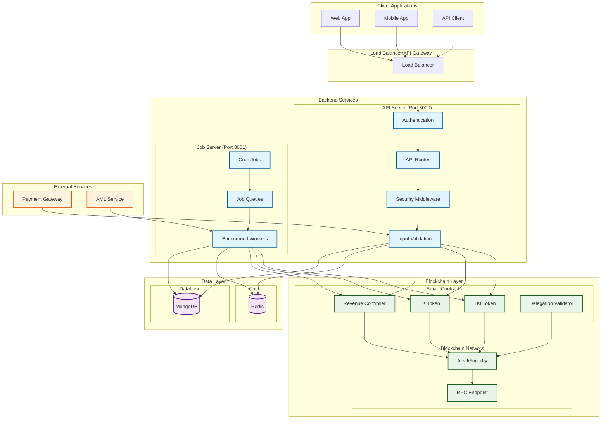
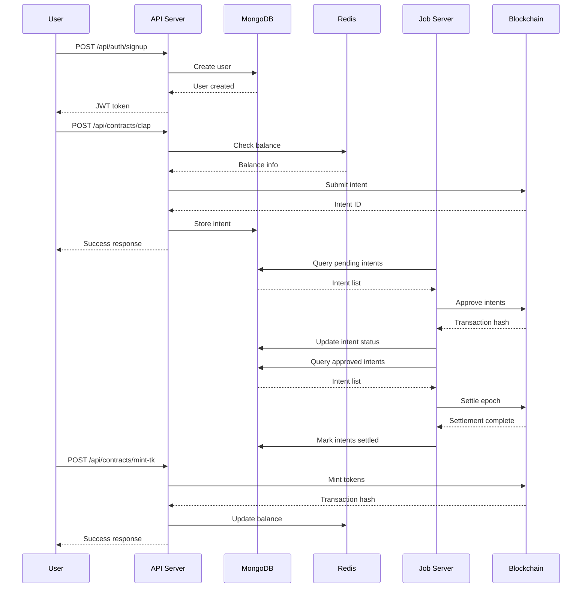
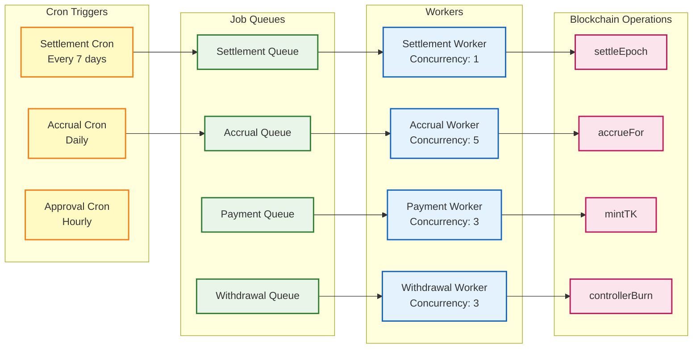
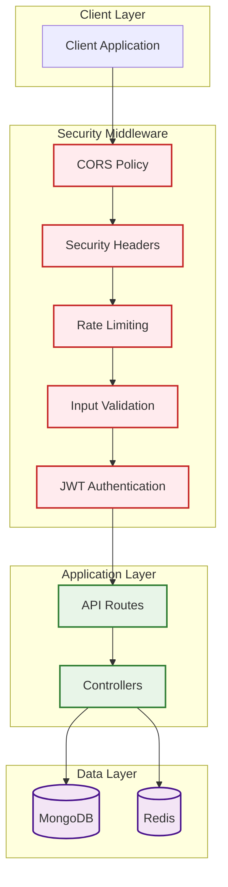
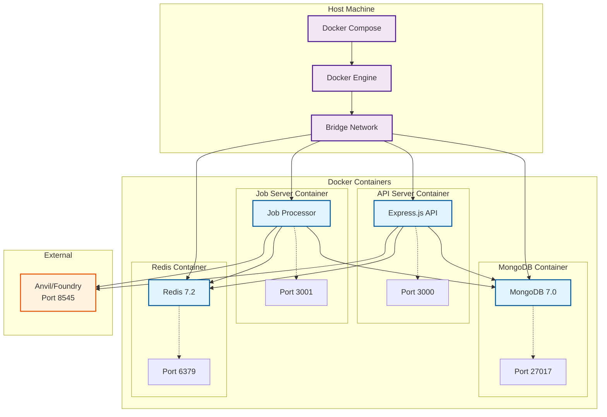

# Backend Architecture Diagram

## System Overview

## Data Flow Diagram

## Job Queue Architecture

## Security Architecture

## Deployment Architecture

## Key Components

### 1. **API Server** (`src/index.ts`)
- Express.js HTTP server
- Authentication middleware
- Route handlers for contracts
- Security middleware (Helmet, CORS, rate limiting)

### 2. **Job Server** (`src/job-server.ts`)
- Background job processing
- Cron job scheduling
- Blockchain operation queuing

### 3. **Smart Contract Integration** (`src/config/blockchain.ts`)
- Viem client configuration
- Contract ABI definitions
- Blockchain operation methods

### 4. **Job Queues** (`src/jobs/queue.ts`)
- BullMQ queue management
- Worker processes
- Job scheduling and retry logic

### 5. **Cron Jobs** (`src/jobs/cron.ts`)
- Automated settlement processing
- Interest accrual
- Intent approval automation

### 6. **Data Models** (`src/models/`)
- User authentication
- Intent tracking
- Payment/withdrawal records

### 7. **API Routes** (`src/routes/`)
- Authentication endpoints
- Contract interaction endpoints
- Balance and intent queries

## Data Flow Summary

1. **User Authentication**: JWT-based auth with role-based access control
2. **Contract Interactions**: Users submit claps/gifts with delegation data
3. **Background Processing**: Jobs are queued for blockchain operations
4. **Automated Settlement**: Cron jobs process approved intents periodically
5. **Caching**: Redis caches balances and frequently accessed data
6. **Persistence**: MongoDB stores users, intents, and transaction records
7. **Blockchain Integration**: Viem handles all smart contract interactions
8. **Security**: Multiple layers of validation, rate limiting, and authentication
